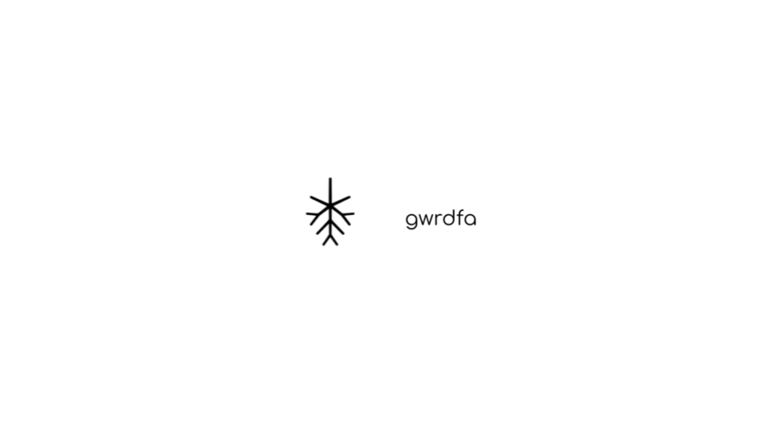

  <picture>
    <source srcset="./assets/gwrdfa.png" media="(prefers-color-scheme: dark)">
    
  </picture>

 

> A Rust implementation Parabyzantine consensus protocols.

# Gwrdfa

Gwrdfa is a Rust implementation of Parabyzantine consensus protocols. 

> [!TIP]
> Parabyzantine protocols are an area of nascent and active research for [Liam Monninger](mailto:liam@ramate.io). To learn more about the current approach to researching them, check out the [write-up](https://docs.google.com/gview?embedded=1&url=https://raw.githubusercontent.com/ramate-io/bfa/main/papers/memo/main.pdf).

## Organization

- **[`gwrdfa`](/gwrdfa/):** contains the implementations for various Parabyzantine protocols in Rust. You'll find building blocks that start up from the base Parabyzantine assumptions. 

## Contributing

| Task | Description |
|------|-------------|
| [Upcoming Events](https://github.com/ramate-io/gwrdfa/issues?q=is%3Aissue%20state%3Aopen%20label%3Apriority%3Ahigh%2Cpriority%3Amedium%20label%3Aevent) | High-priority `event` issues with planned completion dates. |
| [Release Candidates](https://github.com/ramate-io/gwrdfa/issues?q=is%3Aissue%20state%3Aopen%20label%3Arelease-candidate) | Feature-complete versions linked to events. |
| [Features & Bugs](https://github.com/ramate-io/gwrdfa/issues?q=is%3Aissue%20state%3Aopen%20label%3Afeature%2Cbug%20label%3Apriority%3Aurgent%2Cpriority%3Ahigh) | High-priority `feature` and `bug` issues. |
