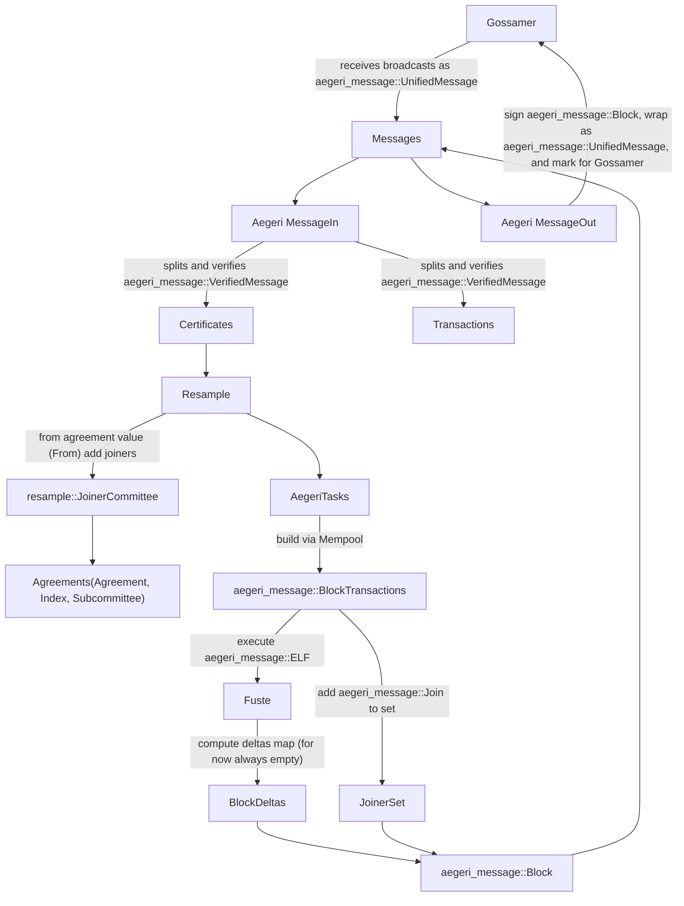

# `aegeri-process`
The process running Aegeri (resample) consensus and computing state transitions over Fuste. 

## Dataflow

```mermaid
flowchart TB
    Gossamer["Gossamer"] -- "receives broadcasts as aegeri_message::UnifiedMessage" -->Messages["Messages"]
    Messages --> AMI["Aegeri MessageIn"]
    AMI -- "splits and verifies aegeri_message::VerifiedMessage<Certificate>" --> Certificates["Certificates"]
    AMI -- "splits and verifies aegeri_message::VerifiedMessage<Transaction>" --> Transactions["Transactions"]
    Certificates --> Resample["Resample"]
    Resample --> AT["AegeriTasks"]
    Resample -- "from agreement value (From<Value = aegeri_message::Block>) add joiners" --> JC["resample::JoinerCommittee"]
    JC --> ISA["Agreements(Agreement, Index, Subcommittee)"]
    AT -- "build via Mempool" --> ABT["aegeri_message::BlockTransactions"]
    ABT -- "execute aegeri_message::ELF" --> Fuste["Fuste"]
    Fuste -- "compute deltas map (for now always empty)" --> BD["BlockDeltas"]
    ABT -- "add aegeri_message::Join to set" --> JS["JoinerSet"]
    BD --> AB["aegeri_message::Block"]
    JS --> AB
    AB --> Messages
    Messages --> AMO["Aegeri MessageOut"] 
    AMO -- "sign aegeri_message::Block, wrap as aegeri_message::UnifiedMessage, and mark for Gossamer" --> Gossamer
```