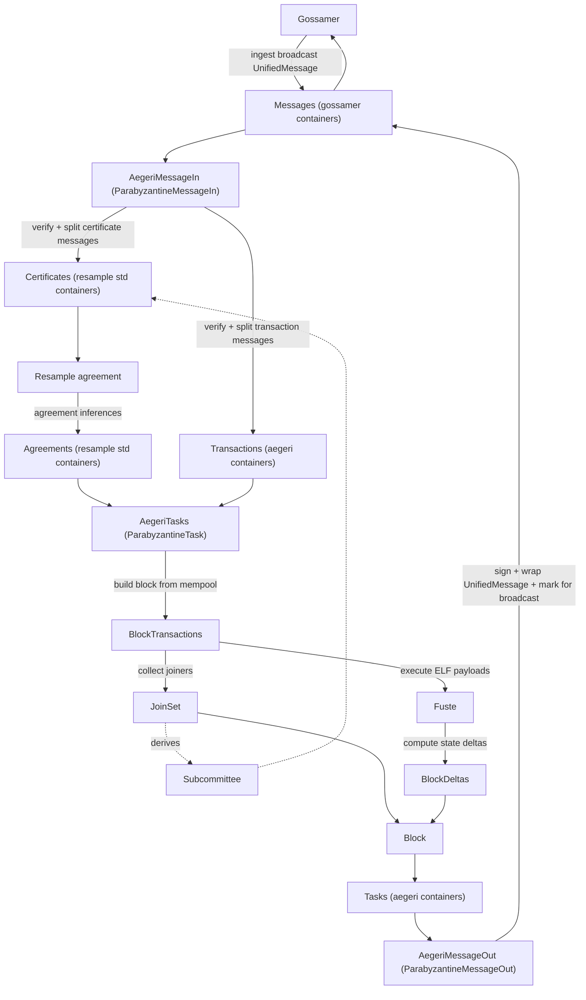
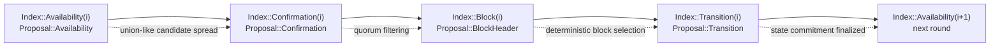

# `aegeri-process`
The process crate for running Aegeri resample consensus and computing state transitions over Fuste.

## Integration Design

`aegeri-process` composes `gossamer` broadcast, `gwrdfa-resample` consensus, and `fuste` execution.

Planned actors:
- `AegeriMessageIn`: implements `ParabyzantineMessageIn`.
- `AegeriTasks`: implements `ParabyzantineTask`.
- `AegeriMessageOut`: implements `ParabyzantineMessageOut`.

Container ownership:
- `Messages`: reuse gossamer message containers.
- `Certificates` and `Agreements`: reuse resample std-backed containers.
- `Transactions` and `Tasks`: define Aegeri-specific containers in this crate.

Message model:
- `aegeri-message` is already implemented and provides `UnifiedMessage`, `Message<T>`, and verification primitives.
- It is expected to evolve as process integration hardens (especially around certificate/transaction boundaries and execution payload ergonomics).

## Dataflow

## Consensus Stages

`aegeri-message` models certificate consensus as layered proposal stages for the same round index:

- `Availability`: replicas advertise candidate transaction IDs they have seen.
- `Confirmation`: replicas narrow to quorum-observed candidates.
- `BlockHeader`: replicas converge on exact block transaction IDs.
- `Transition`: replicas converge on exact post-state commitment (`state_root`, `join_set`).

This staging reduces sensitivity to mempool timing skew by deferring exact agreement
until after candidate-set convergence.

