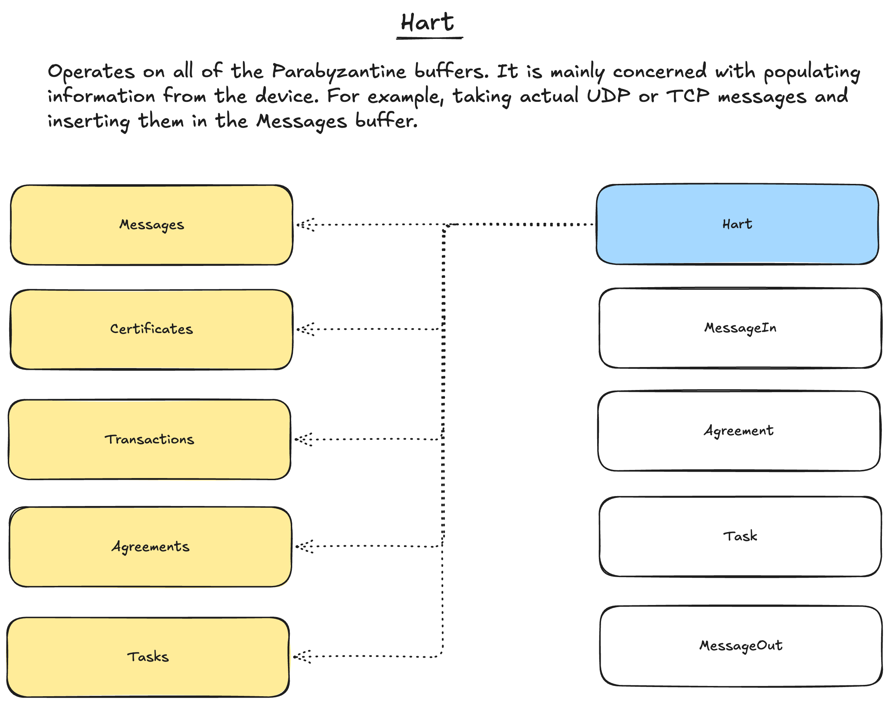
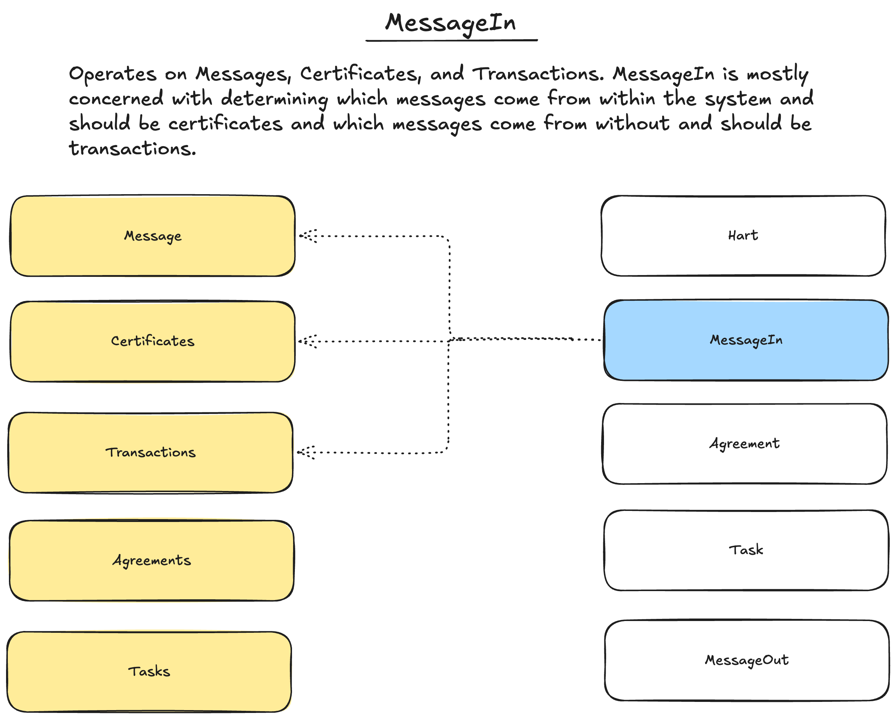
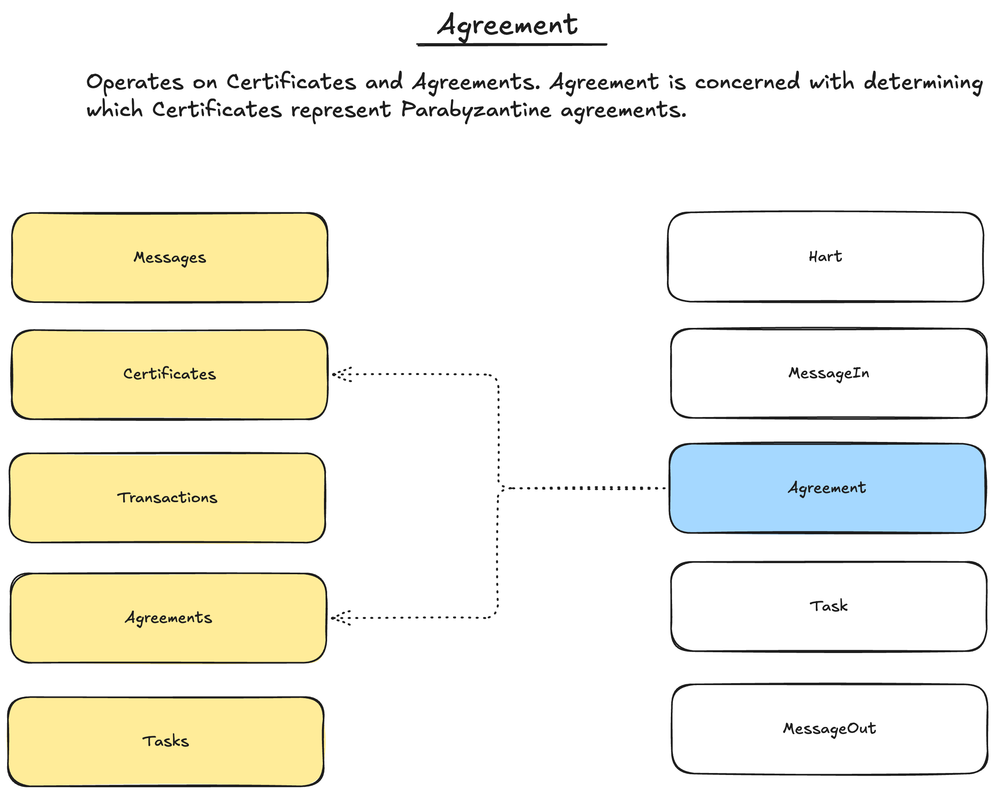
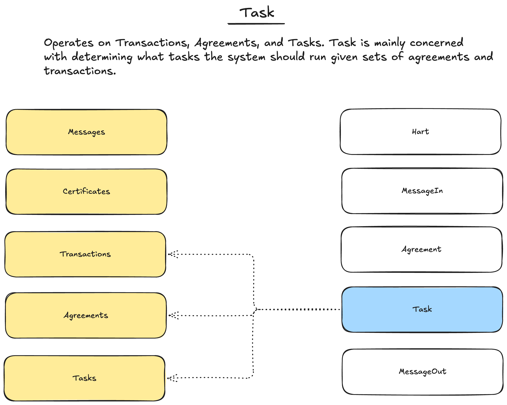
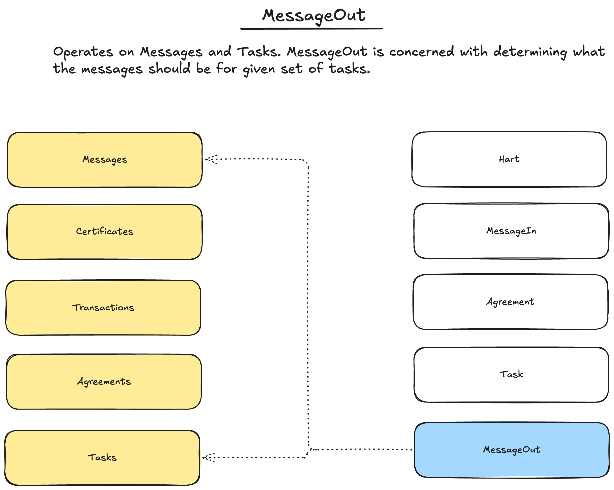

# `parabyzantine`
Primitives matching base Parabyzantine assumptions. 

## Design
`parabyzantine` represents Parabyzantine agreement as a matter of inserting data representing Parabyzantine facts into sets called buffers. There are four buffers with which a Parabyzantine system is concerned:

- `Messages`: the buffer containing all messages passing through the system.
- `Certificates`: the buffer containing all messages from participants within the system, often phrased as "all messages from within the system."
- `Transactions`: the buffer containing all messages not from participants within the system, often phrased as "all messages from without the system."
- `Agreements`: the buffer containing all Parabyzantine agreements. 
- `Tasks`: the buffer containing all tasks for and derived from the system. 

Together these buffers form the memory for the Parabyzantine hart. While we can write programs over all buffers in the hart, `parabyzantine` separates programming into distinct layers for clarity and programmability: 

- [`Hart`](#hart): a subsystem written with access to all Parabyzantine buffers. 
- [`MessageIn`](#messagein): a subsystem written with to handle system inputs. 
- [`Agreement`](#agreement): a subsystem written to compute Parabyzantine agreements. 
- [`Task`](#task): a subsystem written to derive or compute Parabyzantine tasks. 
- [`MessageOut`](#messageout): a subsystem written to handle outputs from the system. 

> [!WARNING]
> `*System` traits are not yet widely support. They are intended to allow rolling up to a scheduler. However, for the time being, we recommend that all users of `Parabynzatine` actors and systems write their own scheduling--imperatively invoking the system. 

### `Hart`

### `MessageIn`

### `Agreement`

### `Task`

### `MessageOut`
