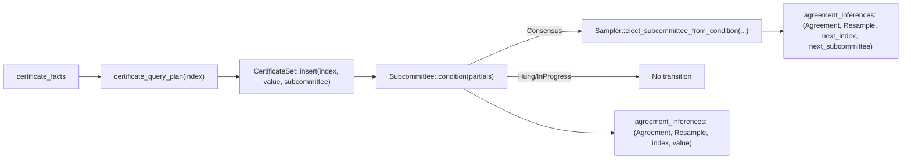

# `gwrdfa-resample-core`

Core resampling protocol logic for `gwrdfa`, built on top of Parabyzantine agreement/task abstractions.

## Design

Resample is modeled as a facts-to-inferences pipeline over Parabyzantine worlds:

1. `certificate_facts` are queried through `ResampleAgreementData::certificate_query_plan(...)`.
2. Matching tuples are inserted into `CertificateSet`.
3. `Subcommittee::condition(...)` computes `Consensus | Hung | InProgress` per index.
4. `Sampler::elect_subcommittee_from_condition(...)` may elect the next `(index, subcommittee)`.
5. `ResampleAgreement` writes inferred agreements into `agreement_inferences`.

The type-level structures behind that flow are:
- [`src/agreement.rs`](./src/agreement.rs): `ResampleAgreement`, `ParabyzantineAgreement` integration, `AgreementWorld<Data>` updates.
- [`src/agreement/data.rs`](./src/agreement/data.rs): `ResampleAgreementData` query/storage contract.
- [`src/agreement/certificate.rs`](./src/agreement/certificate.rs): `CertificateSet`.
- [`src/agreement/subcommittee.rs`](./src/agreement/subcommittee.rs): `Subcommittee::condition`.
- [`src/agreement/sampler.rs`](./src/agreement/sampler.rs): `Sampler` transition policy.
- [`src/agreement/consensus.rs`](./src/agreement/consensus.rs): `Condition` state machine.

## Crate Structure

- [`src/lib.rs`](./src/lib.rs): crate entrypoint and protocol markers (`ForResample`, `Resample`).
- [`src/agreement.rs`](./src/agreement.rs): `ResampleAgreement` protocol wrapper and agreement pipeline.
- [`src/agreement/data.rs`](./src/agreement/data.rs): `ResampleAgreementData` trait contract.
- [`src/agreement/certificate.rs`](./src/agreement/certificate.rs), [`src/agreement/subcommittee.rs`](./src/agreement/subcommittee.rs), [`src/agreement/sampler.rs`](./src/agreement/sampler.rs), [`src/agreement/consensus.rs`](./src/agreement/consensus.rs), [`src/agreement/storage.rs`](./src/agreement/storage.rs): supporting interfaces and semantics.
- [`src/task.rs`](./src/task.rs): `ResampleTask` protocol wrapper.
- [`src/task/data.rs`](./src/task/data.rs), [`src/task/execution.rs`](./src/task/execution.rs), [`src/task/task_subcommittee.rs`](./src/task/task_subcommittee.rs): task-side contracts and execution hooks.
- [`src/agreement/std/`](./src/agreement/std/): std-gated reference implementations and test-friendly data types.

## Agreement Pipeline (High Level)

For each agreed `(index, subcommittee)`:

1. Query certificates marked with `ForResample`.
2. Insert evidence into `CertificateSet`.
3. Evaluate `subcommittee.condition(...)` -> `Consensus`, `Hung`, or `InProgress`.
4. Ask `Sampler` for next subcommittee election when applicable.
5. Emit inferred agreement tuples into the Parabyzantine draft buffer.

With the default std sampler (`ConstantCommittee`):
- consensus advances to the next index with the same subcommittee,
- `Hung`/`InProgress` do not advance.

## Task Pipeline (High Level)

For each agreed index/subcommittee task assignment:

1. Evaluate whether the local sender is assigned (`TaskSubcommittee::is_task_assigned_to`).
2. If assigned, run `ResampleTasker::compute_resample_task(...)`.
3. Produce transaction/task inferences via Parabyzantine facts/inferences buffers.

## Design Updates

Recent refactors in this crate focused on reducing abstraction overhead and making protocol wiring easier to reason about:

- **`no_std`-first with std conveniences**
  - Crate root is `#![cfg_attr(not(feature = "std"), no_std)]`.
  - std-backed reference types live under [`src/agreement/std/`](./src/agreement/std/).
- **Resample marker-scoped certificates**
  - Certificate ingestion keys on `ForResample`.
  - Only certificates tagged for resample are consumed by agreement queries.
- **Clear protocol split**
  - `agreement`: evidence ingestion + condition/transition emission.
  - `task`: local assignment check + execution hooks.
- **Reusable std support layout**
  - [`src/agreement/std/container/`](./src/agreement/std/container/): `AgreementContainer`, `CertificateContainer`, generic `AgreementParabyzantineData`
  - [`src/agreement/std/agreement_data.rs`](./src/agreement/std/agreement_data.rs): `MemoryAgreementData`
  - [`src/agreement/std/constant_committee.rs`](./src/agreement/std/constant_committee.rs): `ConstantCommittee`
  - [`src/agreement/std/voter_set.rs`](./src/agreement/std/voter_set.rs): `VoterSet`
- **Cleaner naming**
  - Wrapper/newtype names are concise and protocol-oriented: `Index`, `Value`, `Subcom`.